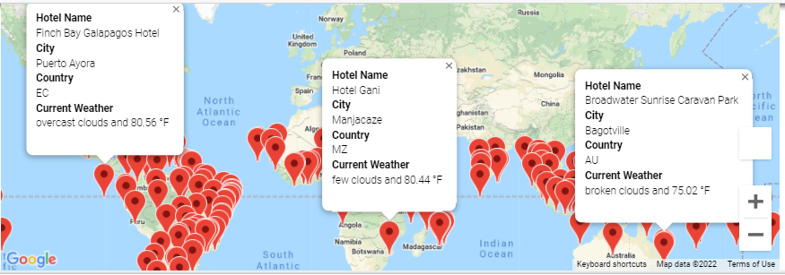
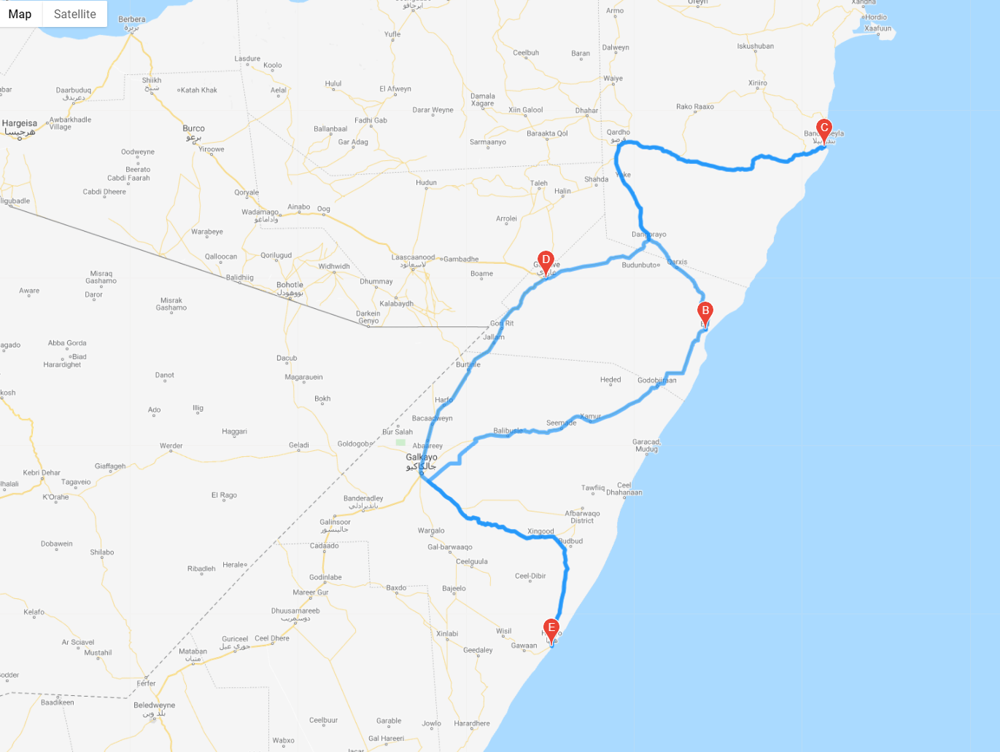
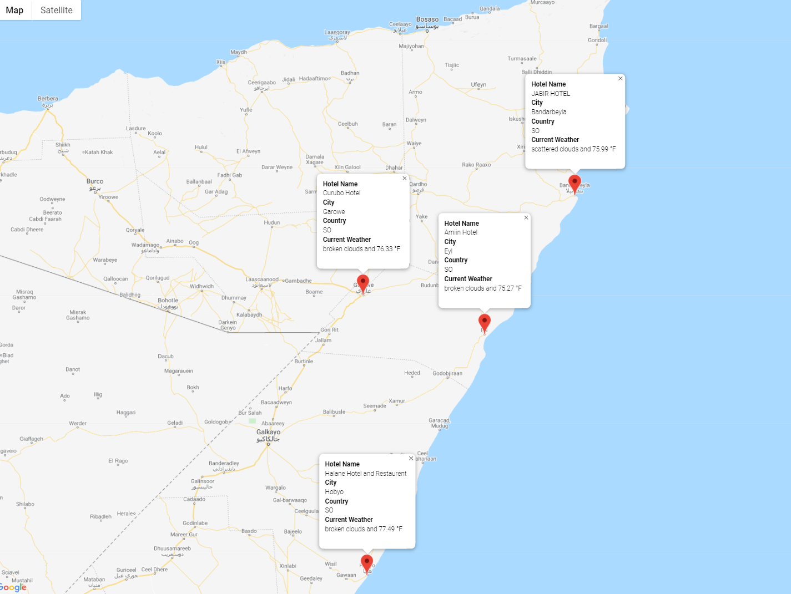

# World Weather Analysis
## Summary
In the [Weather Database](Weather_Database/) folder, 2000 random latitude and longitude coordinates were generated and the `citipy` module was used to find the nearest city. The OpenWeatherMap API was used to retrieve weather information for the generated cities, and the results were compiled into a dataframe and saved as a CSV file. This [CSV](Weather_Database/WeatherPy_Database.csv) was used in the [Vacation Search](Vacation_Search/) folder to select potential vacation destinations within a user-dependent temperature range, and Google's Places API was used to generate the name of a hotel located in each city. This information was used to create a `gmaps` visual with all of the vacation cities displayed along with map markers showing destination and weather information.  

In the [Vacation Itinerary](Vacation_Itinerary/) folder, four vacation destinations in Somalia were selected and Google's Directions API was used to create a travel map of the route between all four destinations, as well as a secondary map that showed map markers displaying hotel, city, and weather information. 

